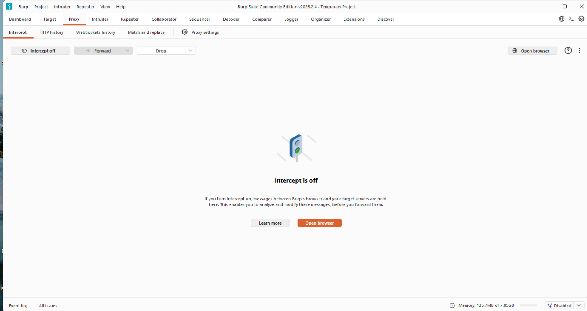
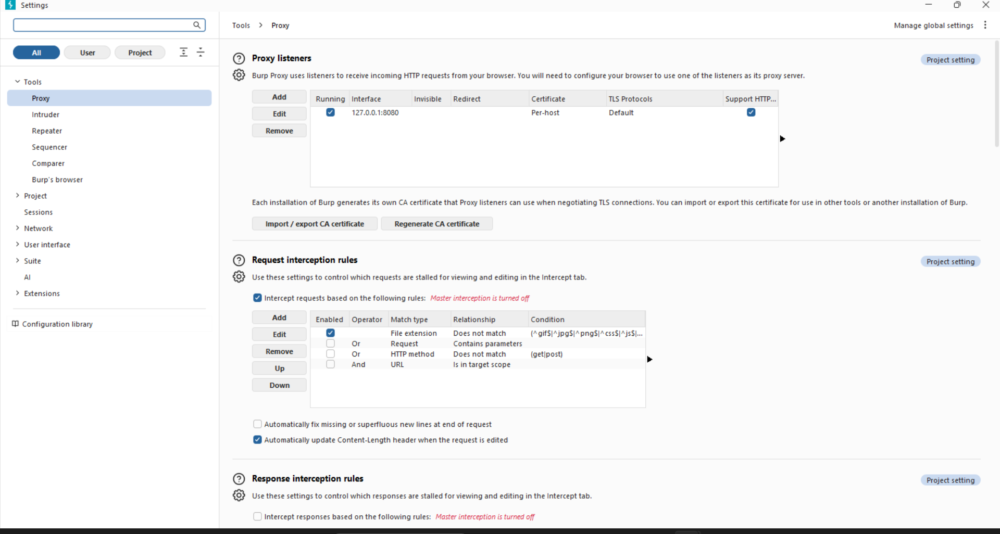
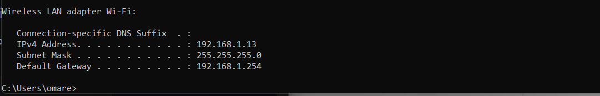
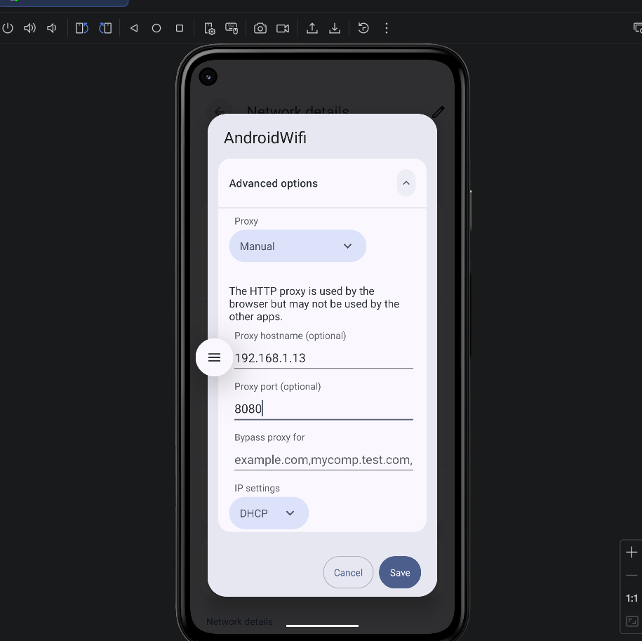
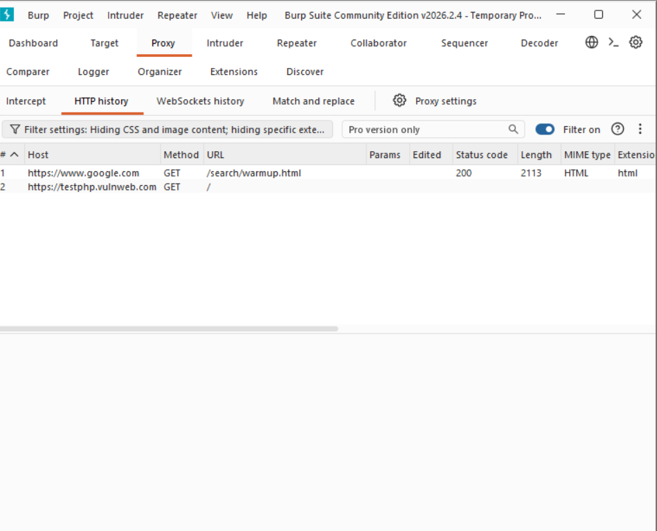
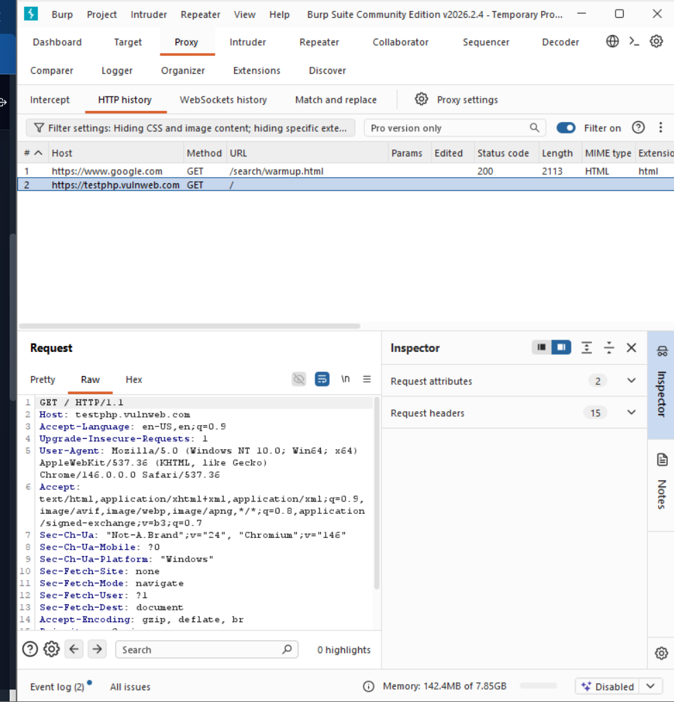
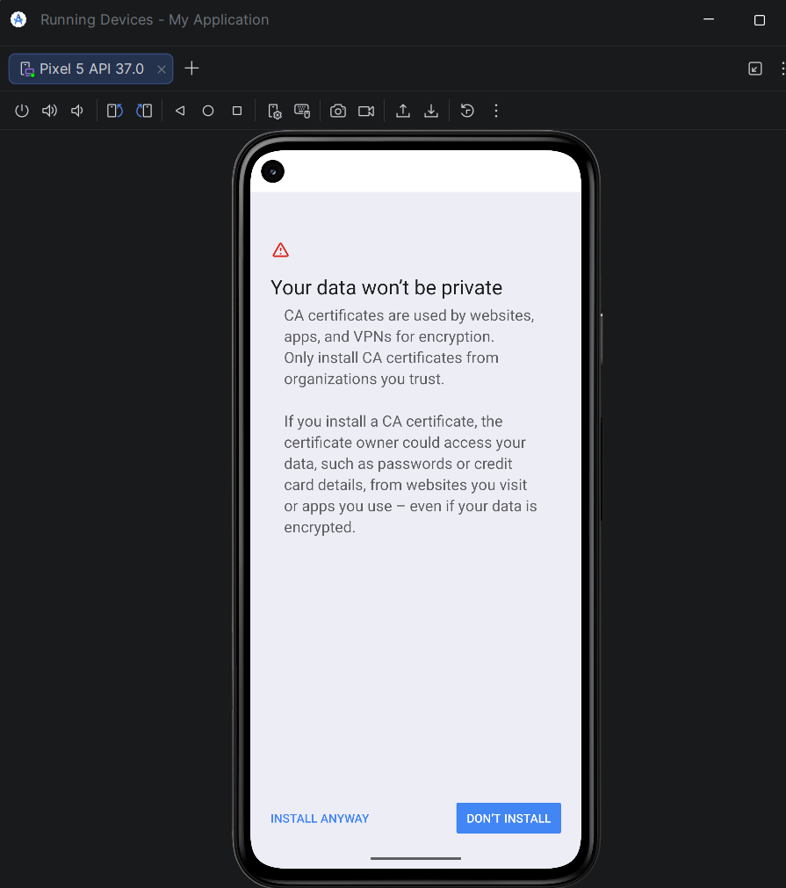

# 🔍 Analyse du Trafic HTTP/HTTPS Android avec Burp Suite

**Course:** Mobile Application Security  
**Analyst:** Omar Haouani  
**Environment:** Android Emulator + Burp Suite  
**Date:** April 2026

---

## 📋 Table of Contents

1. [Introduction](#introduction)
2. [Technical Environment](#technical-environment)
3. [Phase 1: Burp Suite Launch](#phase-1-burp-suite-launch)
4. [Phase 2: Proxy Listener Configuration](#phase-2-proxy-listener-configuration)
5. [Phase 3: Host IP Identification](#phase-3-host-ip-identification)
6. [Phase 4: Emulator Proxy Configuration](#phase-4-emulator-proxy-configuration)
7. [Phase 5: Traffic Capture](#phase-5-traffic-capture)
8. [Phase 6: Request Analysis](#phase-6-request-analysis)
9. [Phase 7: CA Certificate Observation](#phase-7-ca-certificate-observation)
10. [Results Analysis](#results-analysis)
11. [Security Recommendations](#security-recommendations)
12. [Technical Principles](#technical-principles)
13. [Checklist](#checklist)
14. [Resources](#resources)

---

## Introduction

This laboratory focuses on **HTTP/HTTPS traffic analysis** of an Android application using Burp Suite as an intercepting proxy.

### Objectives

- Configure an intercepting proxy on an Android emulator
- Capture and analyze HTTP traffic generated by the browser
- Understand the difference between HTTP and HTTPS
- Observe the CA certificate mechanism
- Produce a complete audit trail

---

## Technical Environment

| Component | Specification |
|-----------|---------------|
| Interception Tool | Burp Suite Community Edition v2026.2.4 |
| Mobile Environment | Android Emulator |
| Host Platform | Windows |
| Authorized Target | http://testphp.vulnweb.com |

### Laboratory Configuration

| Parameter | Value |
|-----------|-------|
| Host IP Address | 192.168.1.13 |
| Listening Port | 8080 |
| Burp Listener | 0.0.0.0:8080 |

---

## Phase 1: Burp Suite Launch

Launch Burp Suite Community Edition and create a temporary project with default options.

---

## Phase 2: Proxy Listener Configuration

In **Proxy → Proxy settings → Proxy Listeners**, edit the listener and set the address to `0.0.0.0` with port `8080` to listen on all network interfaces.

---

## Phase 3: Host IP Identification

On Windows, run `ipconfig` in the terminal and note the IPv4 address of the Wi-Fi network.

**Result:** `192.168.1.13`

---

## Phase 4: Emulator Proxy Configuration

In the emulator, go to **Settings → Wi-Fi → Modify network → Advanced options**, set the proxy to **Manual** mode with the host IP and Burp port.

| Field | Value |
|-------|-------|
| Proxy hostname | 192.168.1.13 |
| Proxy port | 8080 |

---

## Phase 5: Traffic Capture

Open the emulator browser, navigate to `http://testphp.vulnweb.com`, then verify in **Burp → HTTP history** that requests appear.

---

## Phase 6: Request Analysis

Select a request in the history and analyze it via the **Raw** and **Inspector** tabs.

### Findings Observed

| Element | Value | Observation |
|---------|-------|-------------|
| Method | GET | Standard navigation request |
| User-Agent | Chrome/146.0.0.0 | Recent browser |
| Server | nginx | Version exposed |
| Technology | PHP | Backend identified |
| Protocol | HTTP | Clear text traffic |

---

## Phase 7: CA Certificate Observation

In **Settings → Security → Encryption & credentials → Install a certificate**, observe the certificate installation warning screen.

> 💡 HTTPS encrypts traffic and prevents Burp from reading it. A lab CA certificate installed in the emulator allows decrypting this traffic in test environment only.

---

## Results Analysis

### Interpretation

- HTTP traffic circulates in clear text, visible to any interceptor
- Headers reveal technical information (server versions)
- Lack of encryption exposes exchanged data

---

## Security Recommendations

- **Force HTTPS**: Redirect all HTTP traffic to HTTPS
- **Hide versions**: Remove `Server` and `X-Powered-By` headers
- **Keep updated**: Maintain components up to date (PHP, nginx)
- **Valid certificates**: Use TLS certificates signed by recognized authorities
- **Secure cookies**: Add `Secure` and `HttpOnly` attributes

---

## Technical Principles

### HTTP vs HTTPS

| Protocol | Encryption | Use Case |
|----------|------------|----------|
| HTTP | ❌ None | Development only |
| HTTPS | ✅ TLS | Production |

### CA Certificate Role in Laboratory

In a test environment, installing a CA certificate allows Burp to decrypt HTTPS traffic. This operation is never performed on personal or production devices.

---

## Checklist

| # | Checkpoint | Status |
|---|------------|--------|
| 1 | Burp captures requests in HTTP history | ✅ |
| 2 | Proxy listener active on 0.0.0.0:8080 | ✅ |
| 3 | Android proxy configured manually | ✅ |
| 4 | Intercept used for demonstration then disabled | ✅ |
| 5 | Request analysis performed (headers + findings) | ✅ |
| 6 | CA certificate screen observed | ✅ |

---

## Cleanup

After completing the laboratory, the emulator proxy was set back to **None** to restore direct connection.

---
